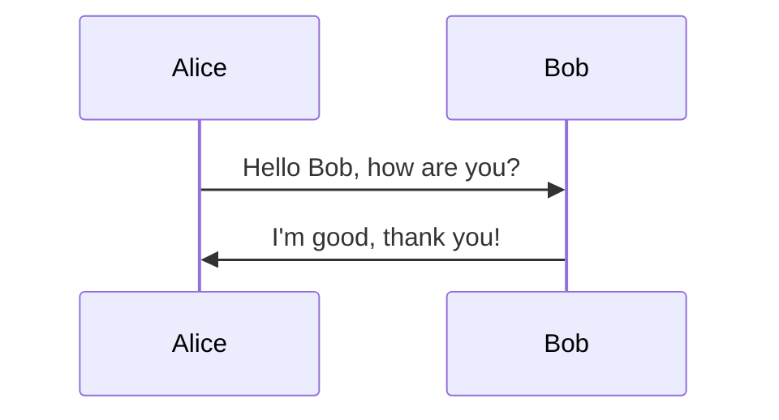
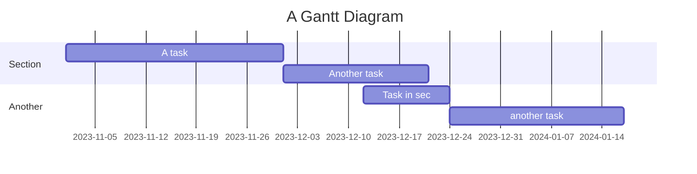
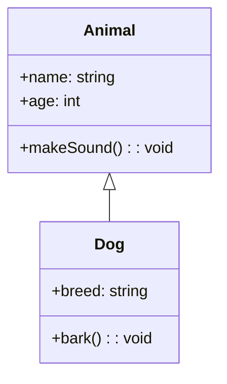
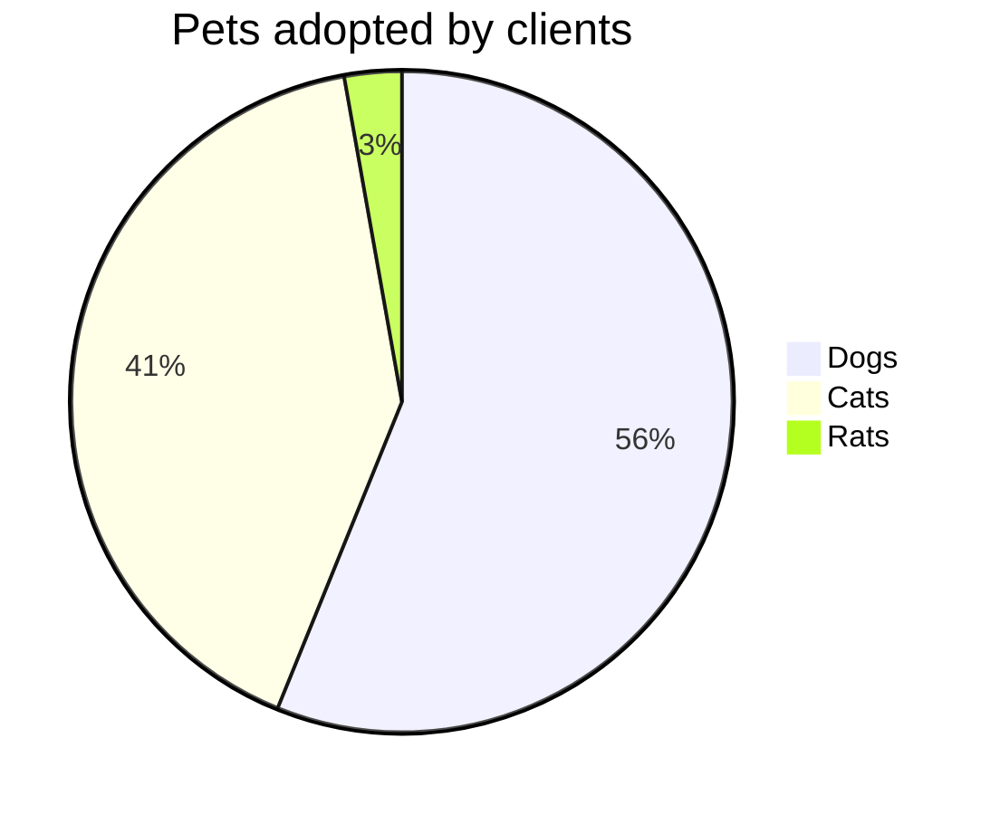
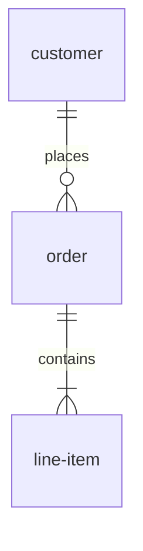
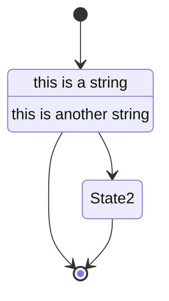
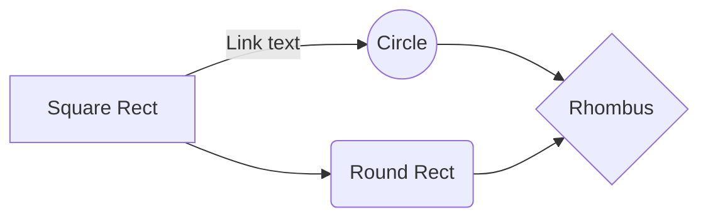
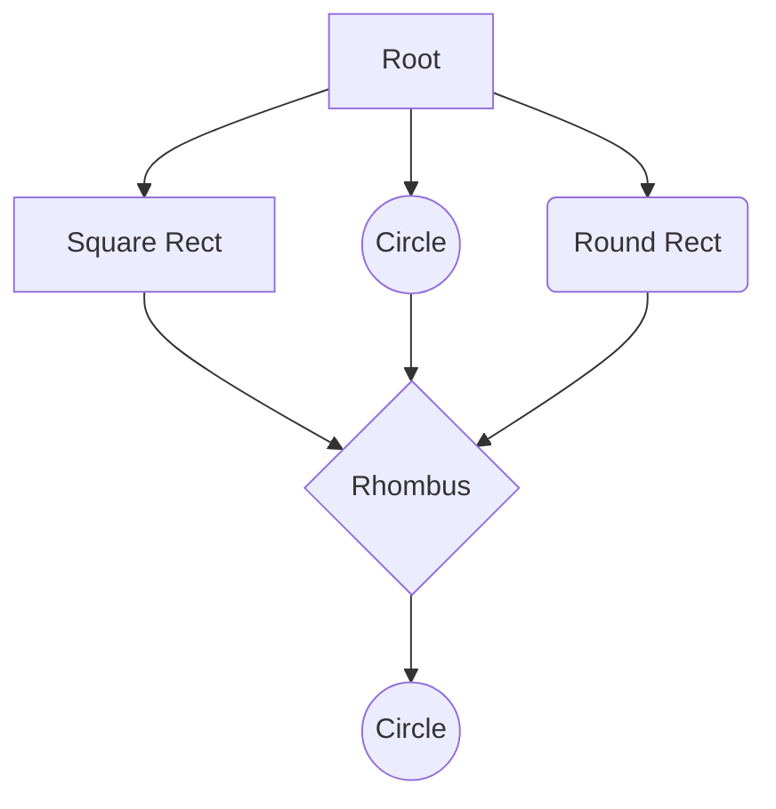

# Mermaid
## mermaid是用来做流程图的语言,用的markdown语言

#### 流程图
```markdown
graph TD;
    A-->B;
    A-->C;
    B-->D;
    C-->D;
```


#### 时序图
```markdown
sequenceDiagram
    participant A as Alice
    participant B as Bob
    A->>B: Hello Bob, how are you?
    B->>A: I'm good, thank you!
```


#### 甘特图
```markdown
gantt
    title A Gantt Diagram
    section Section
    A task           :a1, 2023-11-01, 30d
    Another task     :after a1  , 20d
    section Another
    Task in sec      :2023-12-12  , 12d
    another task    : 24d
```



#### 类图
```markdown
classDiagram
    class Animal {
        +name: string
        +age: int
        +makeSound(): void
    }
    class Dog {
        +breed: string
        +bark(): void
    }
    Animal <|-- Dog
```



#### 饼图

```markdown
pie
    title Pets adopted by clients
    "Dogs" : 42.1
    "Cats" : 30.8
    "Rats" : 2.1
```



#### 实体关系图

```markdown
erDiagram
    customer ||--o{ order : places
    order ||--|{ line-item : contains

```



#### 状态图

```mrakdown
stateDiagram
    [*] --> State1
    State1 --> [*]
    State1 : this is a string
    State1 : this is another string
    State1 --> State2
    State2 --> [*]
```



#### 网络图

```markdown
graph LR
    A[Square Rect] -- Link text --> B((Circle))
    A --> C(Round Rect)
    B --> D{Rhombus}
    C --> D
```



#### 思维导图

```markdown
graph TB
    Root
    A[Square Rect]
    B((Circle))
    C(Round Rect)
    D{Rhombus}
    E((Circle))

    Root --> A
    Root --> B
    Root --> C
    A --> D
    B --> D
    C --> D
    D --> E
```

